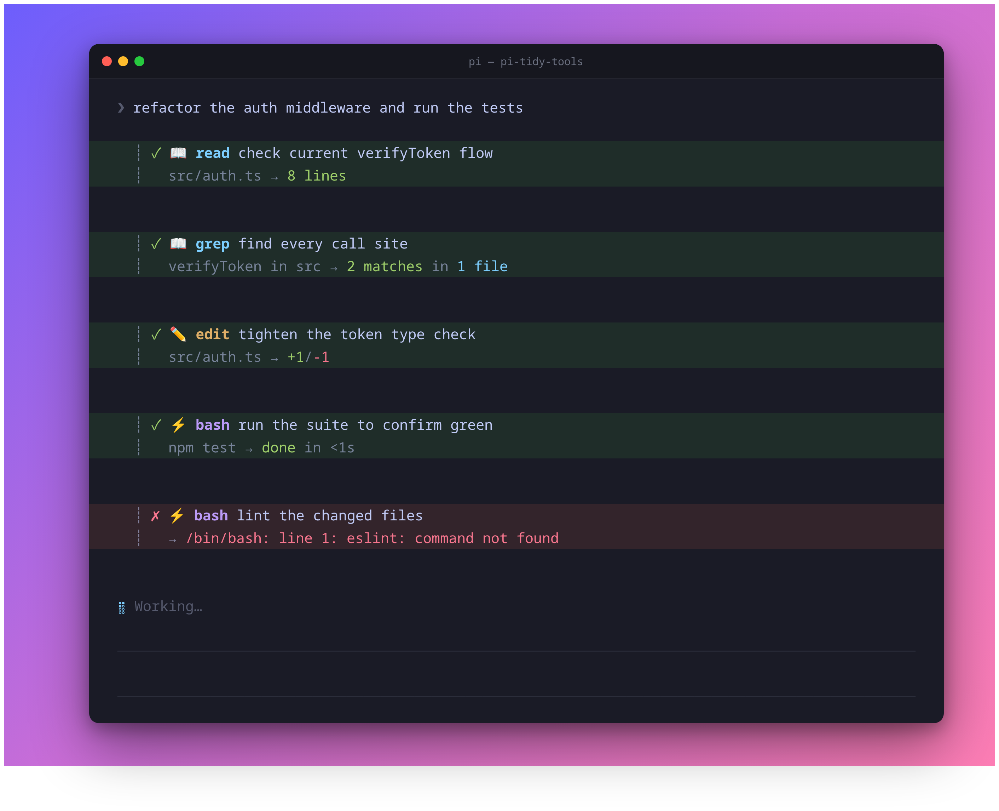

# pi-tidy-tools

**See what your pi agent is doing at a glance.** Restyles [pi](https://github.com/earendil-works/pi-mono)'s
built-in tools into compact, configurable blocks so the transcript reads like
a narrative, not a wall of boxes.

Restyles pi's built-in tools (`read` `write` `edit` `bash` `grep` `find` `ls`)
with a two-line default plus optional one-line reasoning and result layouts:



- **Line 1** — status mark, tool icon/name, and the model's **goal/reasoning** for the call.
- **Line 2** — the concrete target (path/command/pattern) and a colored result summary.

Execution delegates to pi's built-in tools unchanged. The extension replaces
their TUI rendering and, in reasoning-enabled modes, augments their schemas with
a required goal phrase.

## Reasoning headline

In `default` and `reasoning` modes, each wrapped tool gains a required `reasoning`
parameter that the model fills with the *goal* behind the call (not a restatement
of the file or command, which is already shown). `result` mode leaves the native
tool schema unchanged and does not request reasoning.

## Expand for detail (`ctrl+o`)

Collapsed blocks show the two-line summary. Expanding a tool (`ctrl+o`,
`app.tools.expand`) appends its full output:

- **edit** — the colored, line-numbered diff
- **write** — the written content with line numbers
- **bash** — the full (multi-line) command input, then its output
- **read/grep/…** — the raw result text

## `/diff` — last-turn changes

`/diff` (or **`ctrl+shift+o`**) recaps successful `edit`/`write` changes from the
immediately preceding turn. Edits include colored diffs; whole-file writes are
listed as overwrites because pi's write result does not provide a line diff.

> `ctrl+shift+o` also maps to the built-in `app.tree.filter.cycleBackward`; in the
> main transcript it triggers `/diff`. Rebind in `keybindings.json` if you prefer.

## Enable or disable persistently

The extension is enabled by default. Use the management command to change or
inspect its startup state:

```text
/tidy on
/tidy off
/tidy toggle
/tidy status
/tidy mode default
/tidy mode reasoning
/tidy mode result
/tidy mode status
```

Layout modes:

- `default` — reasoning headline, then target and result on line two
- `reasoning` — one line with the reasoning and summarized result
- `result` — one line with the target and summarized result; no reasoning parameter is requested


A successful change is saved to `~/.pi/agent/pi-tidy-tools.json` and reloads pi's
extensions immediately. While disabled, `/tidy` remains available, but all seven
tool overrides, reasoning prompts, diff hooks, `/diff`, its shortcut, and custom
rendering are absent.

For temporary or managed environments, `PI_TIDY_TOOLS` overrides the file. It
accepts `on`/`off`, `true`/`false`, `yes`/`no`, or `1`/`0`. Unset the variable
before using `/tidy on|off|toggle`; `/tidy status` reports when the override is
active. A missing, unreadable, or malformed config defaults to enabled.

## Styling

Mirrors a clean, theme-agnostic palette + icon mapping:

| Tools                    | Icon | Color   |
|--------------------------|------|---------|
| `read` `grep` `find` `ls`| 📖   | cyan    |
| `write` `edit`           | ✏️   | yellow  |
| `bash`                   | ⚡   | magenta |

- Paths collapse `$HOME` → `~`
- `edit` shows `+adds/-dels`; text `write` shows line count; `bash` shows status + elapsed time
- `grep` shows `N matches in M files`; `find`/`ls` show file or entry counts
- Every line is truncated to the live terminal width (ANSI-aware) so nothing wraps past the gutter
- Pi's native pending/success/error background colors remain, without restoring its padding or extra spacing

Raw ANSI is intentional for the foreground palette; tool backgrounds follow the active Pi theme.

## Scope

Only the seven built-in tools are restyled. MCP / third-party tools keep their
default rendering — pi does not expose a way to override a foreign tool's renderer
without owning its execution.

## Usage

Install from npm:

```bash
pi install npm:@mobrienv/pi-tidy-tools
```

Quick-test a local checkout:

```bash
pi -e ./index.ts
```

Or install a local checkout through `~/.pi/agent/settings.json`:

```json
{
  "packages": ["/absolute/path/to/pi-tidy-tools"]
}
```

or drop the directory in `~/.pi/agent/extensions/pi-tidy-tools/`.

## Develop

```bash
npm install
npm test        # native Node test runner
npm run check   # tsc --noEmit
```

## Regenerating the demo image

`docs/demo.png` is generated from **real** renderer output (no hand-typed ANSI):
the demo runs the built-in tools, renders them through the actual extension, and
screenshots the result via headless Chrome.

```bash
bash docs/demo.sh    # hero screenshot
bash docs/modes.sh   # layout-mode comparison
```

Both generators require Google Chrome/Chromium and ImageMagick.
