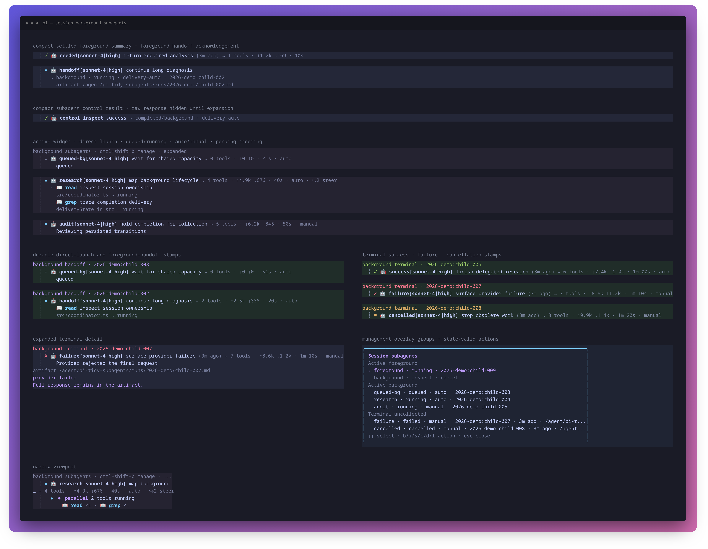

# pi-tidy-subagents

Compact, synchronous RPC fan-out for [Pi](https://github.com/earendil-works/pi-mono). It registers one `subagent` tool whose ordered `agents` each contain an optional label, short transcript reason, and verbatim child prompt.

```bash
pi install npm:@mobrienv/pi-tidy-subagents
```



Children inherit the parent's model, thinking level, working directory, project resources, extensions, skills, and active tools by default. Each child may optionally select an exact registered `provider/model-id` (parsed at the first `/` so model IDs may contain additional separators). Fuzzy patterns, aliases, and profiles are rejected. The complete ordered batch is resolved and validated against Pi's live model registry and configured authentication before any child starts; one invalid model fails the whole call with no partial run artifacts. After process startup, each child reports RPC state before receiving its prompt, and the observed model identity is what compact rendering and schema v2 run manifests record. Delegation itself is disabled in children. A session-wide FIFO queue admits the smaller of half available CPU parallelism and one child per 2 GiB free memory. Calls wait for every child and preserve healthy sibling results after individual failures.

Collapsed output shows one current activity per child; `ctrl+o` shows the latest fifteen. Running children use a stable status dot, and live output redraws only when child state or activity changes. The robot glyph identifies the row as delegated work, so headers omit a redundant `subagent` noun and read `<agentName>[<model>|<thinking>] <reason> → <metrics>`. When that fits, the header stays on one scan-friendly row; narrow viewports move only the metrics to a second row. Metrics report tool calls, directional provider usage (`↑` input and `↓` output), and elapsed duration. Cache traffic is intentionally omitted from the compact header. Complete versioned `run.json` manifests (schema version 2) persist the parent runtime snapshot, per-child requested/resolved/observed model provenance, exact cumulative `input`, `output`, `cacheRead`, `cacheWrite`, and total `providerTraffic` per child alongside responses and normalized child JSONL events beneath Pi's configured agent directory at `pi-tidy-subagents/runs/<run-id>/`. The legacy `tokens` total remains in manifests for compatibility. Legacy child details that only carry top-level `model`/`thinking` remain renderable. Parent results are ordered XML with CDATA-protected Markdown and bounded to 16 KiB per child / 50 KiB total; hidden artifact attributes retain access to complete responses.

> **Filesystem safety:** children share the same working tree. This package does not lock files, create worktrees, or coordinate writes. Allocate non-overlapping mutation scopes or use read-only fan-out.

Installing this beside another extension that owns the `subagent` tool name is unsupported. Detached runs, selective cancellation, personas, overrides, routing hints, and `/subagents` exploration are intentionally outside P0.

## Development

```bash
npm test --workspace @mobrienv/pi-tidy-subagents
npm run check --workspace @mobrienv/pi-tidy-subagents
npm pack --workspace @mobrienv/pi-tidy-subagents --dry-run
```

`npm run smoke` is opt-in and requires a configured real provider. The standard suite uses a deterministic fake RPC executable.

Regenerate the renderer artifact with `bash docs/visual.sh` (Chrome/Chromium and ImageMagick required).
