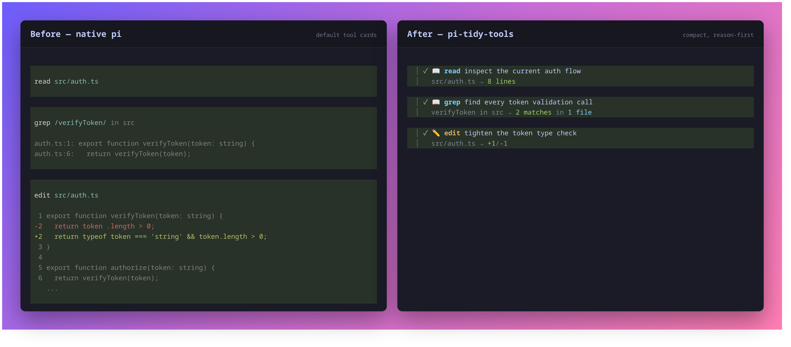
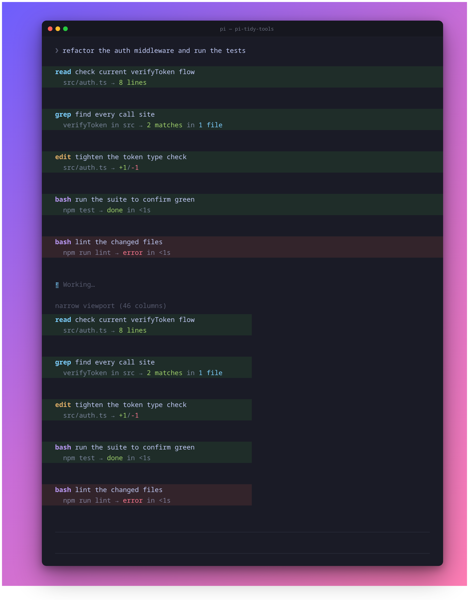
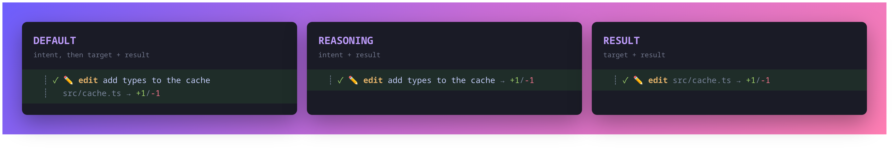

# pi-tidy-tools

[](https://www.npmjs.com/package/@mobrienv/pi-tidy-tools)

**See what your Pi agent is doing at a glance.** Restyles [Pi](https://github.com/earendil-works/pi-mono)'s
built-in tools (`read` `write` `edit` `bash` `grep` `find` `ls`) into compact,
configurable blocks — a two-line default plus optional one-line reasoning and
result layouts — so the transcript reads like a narrative, not a wall of boxes.

## Install

Install the published [npm package](https://www.npmjs.com/package/@mobrienv/pi-tidy-tools) with Pi:

```bash
pi install npm:@mobrienv/pi-tidy-tools
```

Restart Pi or run `/reload` in an existing session. To update or remove later:

```bash
pi update --extension npm:@mobrienv/pi-tidy-tools
pi remove npm:@mobrienv/pi-tidy-tools
```

> Using the optional pi-fff integration? Run `/tidy pi-fff teardown` **before**
> removing pi-tidy-tools or pi-fff — see
> [Optional pi-fff execution](#optional-pi-fff-execution).

## Before and after

The same successful `read`, `grep`, and `edit` calls rendered by native Pi and
pi-tidy-tools:



- **Line 1** — status mark, tool icon/name, and the model's **goal/reasoning**.
- **Line 2** — the concrete target (path/command/pattern) and a colored result summary.

By default, execution delegates to Pi's built-in tools unchanged; only the
schema and rendering change. The optional
[pi-fff integration](#optional-pi-fff-execution) can substitute FFF search
execution behind the same tidy presentation.

## In action



## Reasoning headline

In `default` and `reasoning` modes, each wrapped tool gains a required `reasoning`
parameter that the model fills with the _goal_ behind the call (not a restatement
of the file or command, which is already shown). `result` mode leaves the native
tool schema unchanged and does not request reasoning.

## Expand for detail (`ctrl+o`)

Collapsed blocks show the two-line summary. Expanding a tool (`ctrl+o`,
`app.tools.expand`) appends its full output:

- **edit** — the colored, line-numbered diff
- **write** — the written content with line numbers
- **bash** — the full (multi-line) command input, then its output
- **read/grep/…** — the raw result text

## `/diff` — last-turn changes

`/diff` (or **`ctrl+shift+o`**) recaps successful `edit`/`write` changes from the
immediately preceding turn as colored line-by-line diffs, including new files and
whole-file overwrites.


> `ctrl+shift+o` also maps to the built-in `app.tree.filter.cycleBackward`; in the
> main transcript it triggers `/diff`. Rebind in `keybindings.json` if you prefer.

## Configure with `/tidy`

The extension is enabled by default. Use the management command to change or
inspect its startup state:

```text
/tidy on
/tidy off
/tidy toggle
/tidy status
/tidy mode default
/tidy mode reasoning
/tidy mode result
/tidy mode status
```

Layout modes:

- `default` — reasoning headline, then target and result on line two
- `reasoning` — one line with the reasoning and summarized result
- `result` — one line with the target and summarized result; no reasoning parameter is requested



A successful change is saved to `~/.pi/agent/pi-tidy-tools.json` and reloads Pi's
extensions immediately. While disabled, `/tidy` remains available, but all seven
tool overrides, reasoning prompts, diff hooks, `/diff`, its shortcut, and custom
rendering are absent.

For temporary or managed environments, `PI_TIDY_TOOLS` overrides the file. It
accepts `on`/`off`, `true`/`false`, `yes`/`no`, or `1`/`0`. Unset the variable
before using `/tidy on|off|toggle`; `/tidy status` reports when the override is
active. A missing, unreadable, or malformed config defaults to enabled.

## Optional pi-fff execution

pi-fff is optional and remains a separately installed Pi package — it is not
bundled by, or a peer dependency of, pi-tidy-tools. When set up, FFF's fast
fuzzy search executes behind tidy's presentation. Two capability profiles are
supported, both on Pi **0.80.6+** and with no upper version bound:

- **Legacy** ([`pi-fff`](https://www.npmjs.com/package/pi-fff) **0.1.12+**) —
  pi-fff owns `read`/`grep` execution; tidy owns their schema and rendering.
- **Scoped** ([`@ff-labs/pi-fff`](https://www.npmjs.com/package/@ff-labs/pi-fff)
  **0.6.0+**) — FFF executes tidy-presented `grep` and `find`, native tidy
  `read` is unchanged, and the raw `ffgrep`/`fffind` names stay hidden.

```bash
pi install npm:@ff-labs/pi-fff@0.9.6       # user scope
# or: pi install -l npm:@ff-labs/pi-fff@0.9.6  # project scope
# Legacy remains supported: pi install npm:pi-fff@0.1.12
```

Restart Pi, then explicitly let tidy manage pi-fff registration:

```text
/tidy pi-fff setup
/tidy pi-fff status
/tidy pi-fff teardown
```

Setup previews every discovered user/project settings change and requires
confirmation; teardown restores the exact prior entries. `/tidy pi-fff status`
always reports a truthful ownership state.

Verified version tuples — and how newer releases are promoted from
`forward-compatible/unverified` — are tracked in the
[verification policy](docs/pi-fff.md#verification-policy).

Always run `/tidy pi-fff teardown` **before** removing pi-tidy-tools or pi-fff.

The full integration contract — settings and sidecar mechanics, every ownership
state, the verification policy and release matrix, drift recovery, manual
restoration, and editor caveats — lives in [docs/pi-fff.md](docs/pi-fff.md).

## Styling

Mirrors a clean, theme-agnostic palette + icon mapping:

| Tools                     | Icon | Color   |
| ------------------------- | ---- | ------- |
| `read` `grep` `find` `ls` | 📖   | cyan    |
| `write` `edit`            | ✏️   | yellow  |
| `bash`                    | ⚡   | magenta |

- Paths collapse `$HOME` → `~`
- `edit` shows `+adds/-dels`; text `write` shows line count; `bash` shows status + elapsed time
- `grep` shows `N matches in M files`; `find`/`ls` show file or entry counts
- Every line is truncated to the live terminal width (ANSI-aware) so nothing wraps past the gutter
- Pi's native pending/success/error background colors remain, without restoring its padding or extra spacing

Raw ANSI is intentional for the foreground palette; tool backgrounds follow the active Pi theme.

## Scope

Only the seven built-in tools are restyled. MCP / third-party tools keep their
default rendering — Pi does not expose a way to override a foreign tool's renderer
without owning its execution.

## Troubleshooting

| Symptom                                                                 | Fix                                                                                                                                                                                                              |
| ----------------------------------------------------------------------- | ---------------------------------------------------------------------------------------------------------------------------------------------------------------------------------------------------------------- |
| `/tidy on\|off\|toggle` appears to have no effect                       | The `PI_TIDY_TOOLS` environment variable overrides the config file. Unset it first; `/tidy status` reports when the override is active.                                                                          |
| `ctrl+shift+o` cycles the tree filter instead of running `/diff`        | The shortcut doubles as Pi's built-in `app.tree.filter.cycleBackward`; only the main transcript triggers `/diff`. Rebind in `keybindings.json` if you prefer.                                                    |
| `/tidy pi-fff status` reports `recovery-pending`                        | An interrupted setup/teardown awaits Pi's reload. Run `/reload`; the next startup finalizes the transition at a safe boundary.                                                                                   |
| Status reports `unsafe partial registration; reload required`           | Tool ownership is unknown after a replay failure. Run `/reload` before trusting any `read`/`grep`/`find` claim.                                                                                                  |
| Autocomplete or a custom editor stopped working alongside legacy pi-fff | Legacy pi-fff `0.1.12` installs a custom autocomplete editor that is last-writer-wins with other custom editors. Disable one editor feature and `/reload` — see [editor caveats](docs/pi-fff.md#editor-caveats). |
| Removed pi-fff or pi-tidy-tools without running teardown                | Follow the manual restoration steps in [docs/pi-fff.md](docs/pi-fff.md#drift-recovery-and-removal).                                                                                                              |

## Local development

From the monorepo root, quick-test this workspace:

```bash
pi -e ./packages/pi-tidy-tools/index.ts
```

Or install the workspace through `~/.pi/agent/settings.json`:

```json
{
  "packages": ["/absolute/path/to/repo/packages/pi-tidy-tools"]
}
```

## Develop

Run all workspaces from the repository root:

```bash
npm install
npm test
npm run check
```

Or target this package with `--workspace @mobrienv/pi-tidy-tools`.

## Regenerating screenshots

`docs/comparison.png`, `docs/demo.png`, `docs/diff.png`, and `docs/modes.png` are
generated from **real** renderer output (no hand-typed ANSI): the scripts run the
built-in tools, render them through the actual extension (or native Pi cards for
the comparison), and screenshot the result via headless Chrome.

```bash
bash packages/pi-tidy-tools/docs/comparison.sh # native vs tidy comparison
bash packages/pi-tidy-tools/docs/demo.sh       # full tidy transcript
bash packages/pi-tidy-tools/docs/diff.sh       # /diff last-turn recap
bash packages/pi-tidy-tools/docs/modes.sh      # layout-mode comparison
```

All four generators require Google Chrome/Chromium and ImageMagick.
